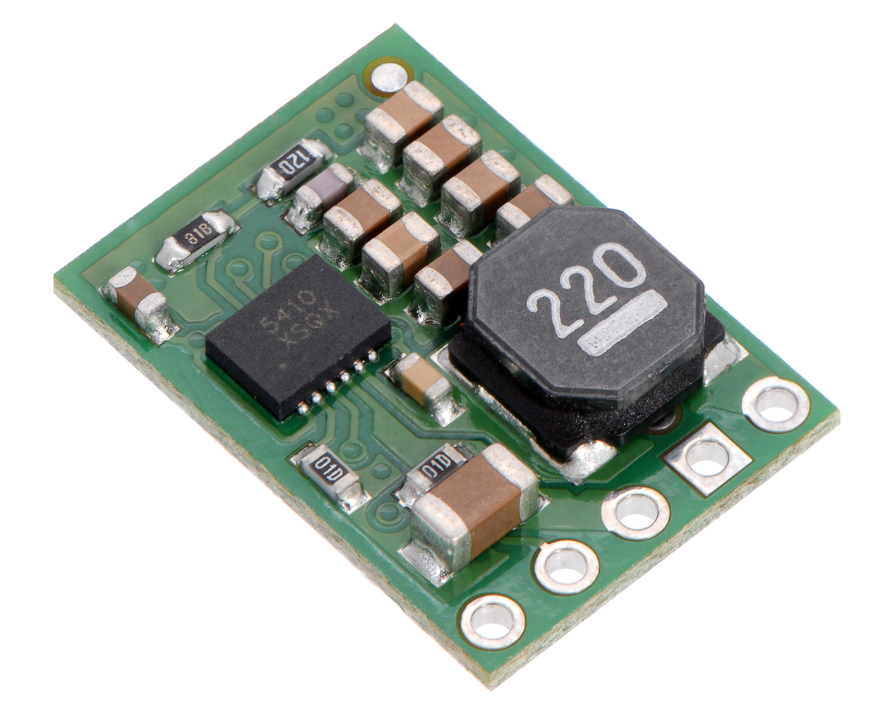

# acw02_esphome (for teknopoint AC only for the moment)

## installation : 
### python:
install python 3.11 from microsoft store

### update pip:
```
 pip install --upgrade pip
```

### esphome:
```
pip install esphome==2025.6.3
```

### Settings
#### Base settings
open esphome-acw02-en.yaml or esphome-acw02-fr.yaml (depending on your preferred language EN or FR)

edite substitutions, you can modify 
 - dev_name
 - dev_friendly
 - api_encrypted_key
 - ota_password
 - ap_password
 - web_server_username
 - web_server_password

```
substitutions:
  dev_name: acw02-salon
  dev_friendly: ACW02 salon
  lang: "en"
  api_encrypted_key: "D2oldc0VP++fni6src89tCSC0UwBhNPgyc8vgYN8/mA="
  ota_password: "REPLACE_WITH_YOUR_PASSWORD"
  ap_password: "fallbackpassword"
  web_server_username: admin
  web_server_password: admin
  board: esp32dev
```

I recommend going to this page to obtain a unique api_encrypted_key:
https://esphome.io/components/api.html

#### WIFI & WEB server settings
open file secrets.yaml and put on this file your WIFI settings and your desired username and password for the web server
```
wifi_ssid: "testesp32"
wifi_password: "testesp32"
wifi_ssid2: "testesp32"
wifi_password2: "testesp32"
wifi_ssid3: "testesp32"
wifi_password3: "testesp32"
```

### build 
```
.\build-fr.bat
```

or 

```
.\build-en.bat
```

### PCB
#### Gerber file présent in PCB directory
[GERBER File](https://github.com/devildant/acw02_esphome/raw/main/PCB/Gerber_climEspHome_esp32_d1_mini_PCB_climEspHome_esp32_d1_mini_2025-07-03.zip)


#### Components: 
- [12v => 5v (x1): D24V10F5](https://shop.mchobby.be/fr/regulateurs/554--regul-5v-1a-step-down-d24v10f5-3232100005549-pololu.html) [manufacturer](https://www.pololu.com/product/2831)

  

- [4 Channels Logic Level Converter Bi-Directional Shifter (x1): CYT1076](https://amzn.eu/d/2MhG08s)

  

- [ESP32-WROOM-32 D1 Mini NodeMCU (x1)](https://amzn.eu/d/3mS1B7W)

  

- [5 pins male 2.54mm (x1) : MaleL7.5-1X5P](https://fr.aliexpress.com/item/1005007128029220.html?spm=a2g0o.order_detail.order_detail_item.3.23f47d56yxv1SG&gatewayAdapt=glo2fra)

  

- [6 pins male 2.54mm (x2) : MaleL7.5-1X6p](https://fr.aliexpress.com/item/1005007128029220.html?spm=a2g0o.order_detail.order_detail_item.3.23f47d56yxv1SG&gatewayAdapt=glo2fra)

  

- [10 pins male 2.54mm (x2) : MaleL7.5-1X10P](https://fr.aliexpress.com/item/1005007128029220.html?spm=a2g0o.order_detail.order_detail_item.3.23f47d56yxv1SG&gatewayAdapt=glo2fra)

  

- [connector : JST XA 2.5 male 4 pins (Reverse direction) (x1)](https://www.aliexpress.com/item/1005008857984831.html?spm=a2g0o.cart.0.0.1dbf38daf0fL06&mp=1&pdp_npi=5%40dis%21EUR%21EUR%206.99%21EUR%206.99%21%21EUR%206.99%21%21%21%40210388c917527810571957734e8cea%2112000048990124847%21ct%21FR%211681384252%21%211%210)

  

  Important: take reverse connexion for have this cable order : 

  

##### PCB solder and cable:


- 12v : RED
- RX  : BLACK
- TX  : YELLOW
- GND : GREEN

Note: solder pins between the esp32 and the PCB (red square)


### 3d file comming soon


### Option : QRCODE info
#### You can generate a QR code to store module information.

- To do this, open the create_QRcode_info.html file in your browser.

- Import the esphome-acw02-en.yaml or esphome-acw02-fr.yaml file.

- Verify the information and click on the QR code to download it.

- Print it and stick it on the module.

### Note: important
This component requires MQTT to function. I invite you to check how to install and configure it in Home Assistant.

> ⚠️ **WARNING**  
> Be careful with what you're doing, and make sure you have the necessary knowledge before attempting anything.  
> I will not be responsible if you damage your device (air conditioner, ESP, etc.).
